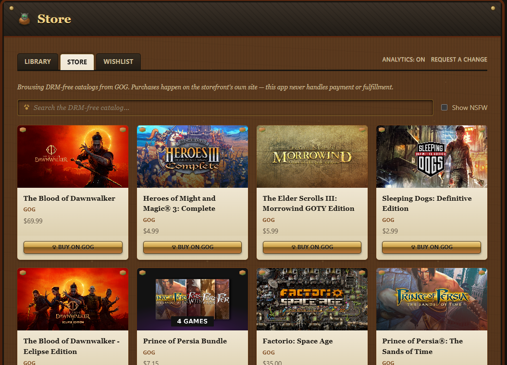

# DRM-Free Launcher

**One library for every launcher you already use — and a clear path off DRM when there's a DRM-free version waiting.**

[](https://github.com/near-wizard/drmfree-launcher/actions/workflows/ci.yml)
[](https://github.com/near-wizard/drmfree-launcher/releases)
[](LICENSE)

DRM-Free Launcher detects the games you already have installed via
Steam, GOG, and Epic, and puts them in one list you can launch from
directly — no new accounts, no re-linking your libraries, nothing
sent to us. Then it does something none of those launchers will: for
any game in your library, it checks GOG's DRM-free catalog for an
equivalent and gives you a one-click path to buy it there instead —
so going DRM-free is a choice you can make one game at a time, not an
all-or-nothing migration.

<p align="center">
  
</p>

## Download

Grab the latest installer from the
**[Releases page](https://github.com/near-wizard/drmfree-launcher/releases)**
— Windows (MSI/NSIS), Linux, and macOS builds. No account required, no
auto-updater yet (check back on Releases for new versions). Anonymous
usage analytics are opt-in and off by default — see below.

## What it does

- **Unified library.** Steam, GOG, and Epic games detected from local
  install data and launched with one click — each through that
  storefront's own native handoff (Steam protocol URI, direct
  executable for GOG, Epic protocol URI). Search, filter by source or
  DRM status, sort by name/source/recently played.
- **DRM-free upgrade finder.** Check any installed game against GOG's
  catalog — an exact-title match, not a fuzzy guess, so you won't get
  a false "yes" on a demo or the wrong edition. Match once, and it's
  remembered; check your whole library in one pass if you'd rather not
  click through titles one at a time.
- **Store tab.** Browse and search GOG's DRM-free catalog directly,
  with an NSFW filter on by default. Buying happens on gog.com — this
  app never touches payment or fulfillment.
- **No accounts.** Detection reads local install manifests and
  registry keys only; it never calls a storefront's web API to ask
  what you own. See
  [`docs/decisions/0002-local-scan-not-ownership-api.md`](docs/decisions/0002-local-scan-not-ownership-api.md).
- **Opt-in analytics, off by default.** The app asks once whether to
  enable anonymous usage analytics (which features get used); nothing
  is sent unless you say yes, and you can flip it off anytime from the
  "Analytics" toggle. Game names, search text, and file paths are
  never collected. See
  [`docs/decisions/0012-opt-in-analytics.md`](docs/decisions/0012-opt-in-analytics.md).

Something missing, or found a bug? Use the **Request a change** link
in the app — it opens a pre-filled GitHub issue with your app version
already attached.

## How detection works

Each storefront is a `GameProvider` (`src-tauri/src/providers/`). A
provider only ever reads local install manifests/registry keys already
on disk — it never calls a storefront's web API to ask what you own.
Launching hands off to the OS/provider's own mechanism:

- **Steam** — reads `appmanifest_*.acf` files in each Steam library,
  launches via the `steam://rungameid/<appid>` protocol handler.
- **GOG** — Windows: reads the `GOG.com\Games` registry keys. Linux:
  GOG ships no native client there, so this reads
  [Heroic Games Launcher](https://heroicgameslauncher.com/)'s own data
  instead (`~/.config/heroic/gog_store/`) — best-effort, since that
  schema isn't officially documented (see the code comment in
  `providers/gog.rs` for specifics). macOS: not yet supported. Either
  way, runs the installed executable directly — GOG titles are
  DRM-free, so there's no Galaxy handoff and Galaxy doesn't need to be
  installed.
- **Epic** — reads `.item` manifest files under the Epic Games
  Launcher's `Data/Manifests` directory (Windows/macOS — Epic has no
  native Linux client), launches via the
  `com.epicgames.launcher://apps/<AppName>?action=launch` protocol
  handler.

Adding a new provider means implementing the `GameProvider` trait —
nothing in the core app or UI is storefront-specific.

## Development

```sh
npm install
npm run tauri dev
```

```sh
npm run lint    # ESLint (frontend)
npm run build   # tsc + vite build
cargo check --manifest-path src-tauri/Cargo.toml
cargo clippy --manifest-path src-tauri/Cargo.toml --all-targets -- -D warnings
cargo test --manifest-path src-tauri/Cargo.toml
```

## Contributing

Open to contributions — see [`docs/CONTRIBUTING.md`](docs/CONTRIBUTING.md)
for dev setup, how to add a new storefront provider, and PR
expectations. Also see the [`docs/CODE_OF_CONDUCT.md`](docs/CODE_OF_CONDUCT.md)
and [`docs/roadmap.md`](docs/roadmap.md) / [`docs/decisions/`](docs/decisions/)
for where the project's headed and why past calls were made.

## License

MIT — see [`LICENSE`](LICENSE) and [`docs/decisions/0004-license.md`](docs/decisions/0004-license.md) for the reasoning.
